# Slide To Act

[](https://circleci.com/gh/cortinico/slidetoact/tree/master)  [](https://maven-badges.herokuapp.com/maven-central/com.ncorti/slidetoact) [](http://androidweekly.net/issues/issue-336) [](https://opensource.org/licenses/MIT) [](http://twitter.com/cortinico) [](https://github.com/KotlinBy/awesome-kotlin)

A simple *Slide to Unlock* **Material** widget for **Android**, written in [**Kotlin**](https://github.com/JetBrains/kotlin) 🇰.

<p align="center">
  
</p>

* [Getting Started](#getting-started-)
* [Example](#example-)
* [Features](#features-)
    * [Attributes](#attributes)
        * [``area_margin``](#area_margin)
        * [``inner_color`` & ``outer_color``](#inner_color--outer_color)
        * [``border_radius``](#border_radius)
        * [``text``, ``text_size``, ``text_style``, ``text_appearance``](#text-text_size-text_style-text_appearance)
        * [``slider_height``](#slider_height)
        * [``slider_locked``](#slider_locked)
        * [``animation_duration``](#animation_duration)
        * [``slider_reversed``](#slider_reversed)
        * [``slider_icon``](#slider_icon)
        * [``complete_icon``](#complete_icon)
        * [``bump_vibration``](#bump_vibration)
        * [``rotate_icon``](#rotate_icon)
        * [``android:elevation``](#androidelevation)
        * [``state_complete``](#state_complete)
    * [Event callbacks](#event-callbacks)
* [Demo](#demo-)
* [Building/Testing](#buildingtesting-)
    * [CircleCI](#circleci-)
    * [TravisCI](#travisci-)
    * [Building locally](#building-locally)
    * [Testing](#testing)
* [Contributing](#contributing-)
* [Honorable Mentions](#honorable-mentions-)
* [License](#license-)

## Getting Started 👣

**Slide To Act** is distributed through [Maven Central](https://search.maven.org/artifact/com.ncorti/slidetoact). To use it you need to add the following **Gradle dependency** to your **android app gradle file** (NOT the root file):

```groovy
dependencies {
   implementation "com.ncorti:slidetoact:0.9.0"
}
```

Or you can download the .AAR artifact [directly from Maven Central](https://search.maven.org/artifact/com.ncorti/slidetoact/0.9.0/aar).

## Example 🚸

After setting up the Gradle dependency, you can use ``SlideToActView`` widgets inside your **XML Layout files**

```xml
<com.ncorti.slidetoact.SlideToActView
    android:id="@+id/example"
    android:layout_width="match_parent"
    android:layout_height="wrap_content"
    app:text="Example" />
```

And bind them inside your **Java/Kotlin** code:
```java
SlideToActView sta = (SlideToActView) findViewById(R.id.example);
```

## Features 🎨

* **100% Vectorial**, no .png or other assets provided.
* **Fancy animations!** 🦄
* **API >= 14** compatible (since v0.2.0)
* Easy to integrate (just a gradle compile line).
* Integrated with your **app theme** 🖼.
* Works **out of the box**, no customization needed.
* Written in **Kotlin** (but you don't need Kotlin to use it)!
* **UX Friendly** 🐣, button will bump to complete if it's over the 80% of the slider (see the following gif).

<p align="center">
  
</p>

### Attributes

By the default, every ``SlideToActView`` widget fits to your app using the ``colorAccent`` and the ``colorBackground`` parameters from your theme. You can customize your ``SlideToActView`` using the following **custom attributes**.

```xml
<com.ncorti.slidetoact.SlideToActView
    android:id="@+id/example_gray_on_green"
    android:layout_width="match_parent"
    android:layout_height="wrap_content"
    android:elevation="6dp"
    app:area_margin="4dp"
    app:animation_duration="250"
    app:outer_color="@color/green"
    app:inner_color="@color/grey"
    app:border_radius="2dp"
    app:text="Testing all the custom attributes"
    app:text_size="12sp"
    app:slider_height="80dp"
    app:slider_locked="false" />
```

#### ``area_margin``

Use the ``area_marging`` attribute to control the **margin of the inner circular button** from the outside area. If not set, this attribute defaults to **8dp**.

<p align="center">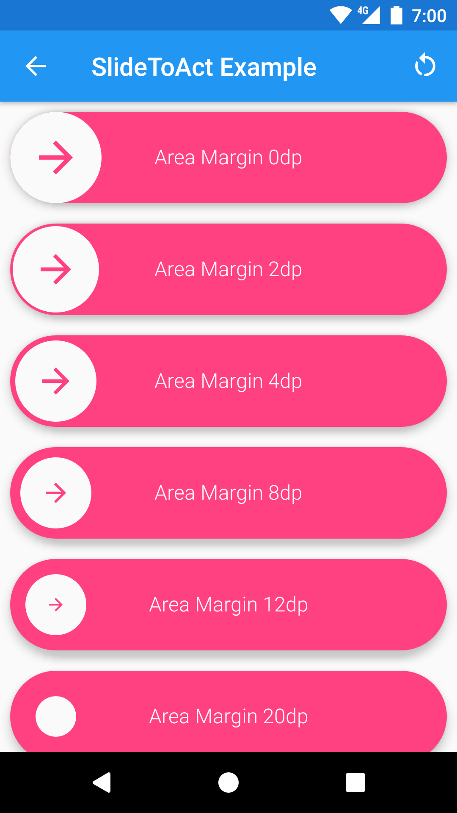 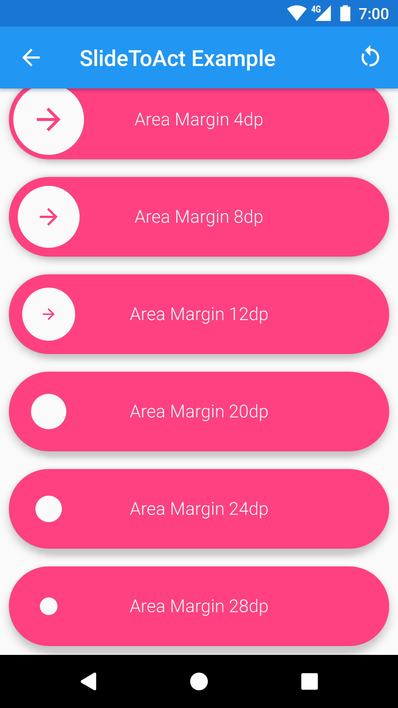</p>

You can also use a **negative** value to have the inner circular button bigger than the slider. To achieve this effect you also need to set `android:clipChildren="false"` on the parent layout, like:

```xml
<FrameLayout
    android:layout_width="match_parent"
    android:layout_height="wrap_content"
    android:clipChildren="false">

    <com.ncorti.slidetoact.SlideToActView
        android:layout_width="match_parent"
        android:layout_height="wrap_content"
        app:area_margin="-8dp"/>
```

to obtain this behavior:

<p align="center"></p>

#### ``icon_margin``

The attribute ``icon_margin`` let you control the margin of the icon inside the circular button. This makes the icon bigger because can take up more space in the button. 

This is especially useful when you want to make the height of the slider smaller (see ``slider_height``). In this case, if you don't adjust the ``icon_margin`` the image can be too much tiny. By default, the ``icon_margin`` is set to 16dp.

In next image you can see how it looks like:

<p align="center">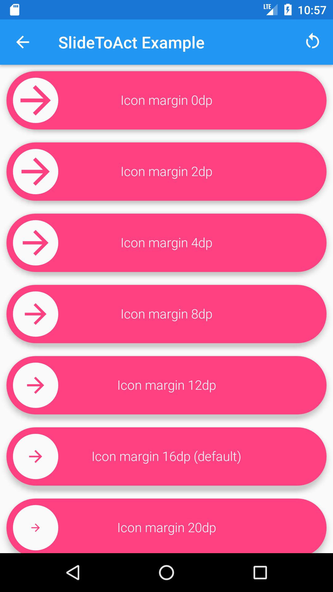 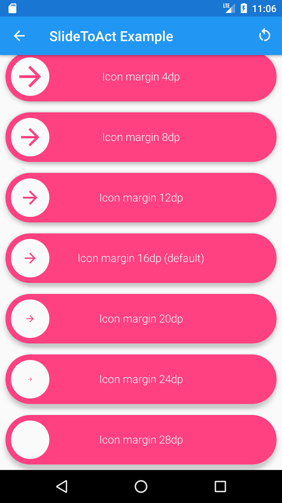</p>

#### ``inner_color`` & ``outer_color``

Use the ``outer_color`` attribute to control the **color of the external area** and the **color of the arrow icon**. If not set, this attribute defaults to **colorAccent** from your theme.

Use the ``inner_color`` attribute to control the **color of the inner circular button**, the **color of the tick icon** and the **color of the text**. If not set, this attribute defaults to **colorBackground** from your theme.

<p align="center">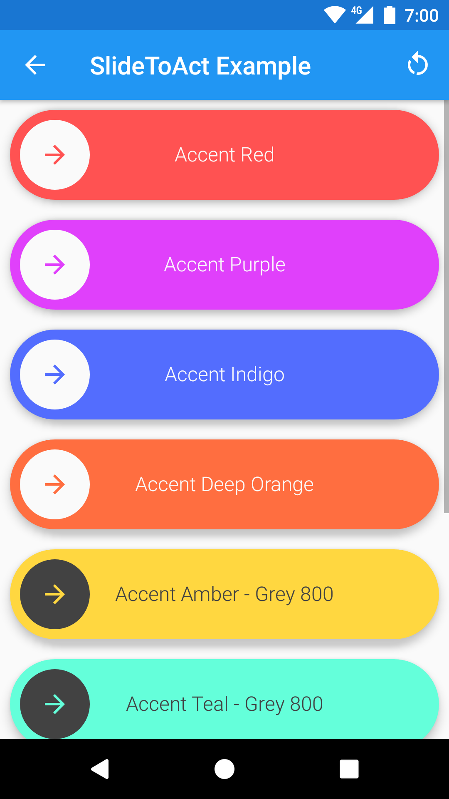 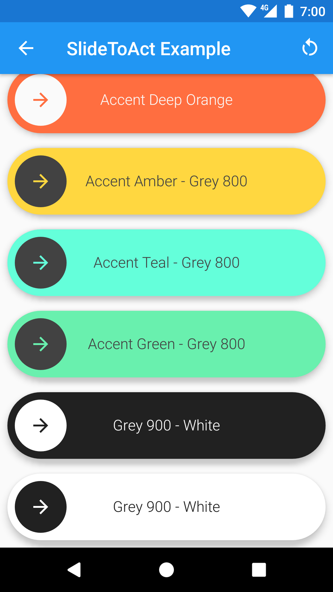</p>

#### ``border_radius``

Use the ``border_radius`` attribute to control the **radius** of the **inner circular button** and of the **external area**. A ``border_radius`` set to **0dp** will result in a square slider. If not set, this attribute will render your slider as a **circle** (default behavior).

<p align="center"> 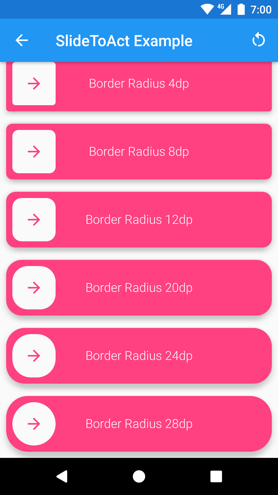</p>

#### ``text``, ``text_size``, ``text_style``, ``text_appearance``

Use the ``text`` attribute to control the **text of your slider**. If not set, this attribute defaults to **SlideToActView**. 

Use the ``text_size`` attribute to control the **size** of the **text of your slider**. A ``text_size`` set to **0sp** will result in hiding the text. If not set, this attribute defaults to **16sp**.

Use the ``text_style`` attribute to control the **style** of your text. Accepted values are ``normal``, ``bold`` and ``italic``.

Use the ``text_appearance`` attribute to provide an Android `TextAppearance` style to fully customize your Text.
Please use this attribute if you want to use a **custom font** or set the text to be **all caps**.

<p align="center"> 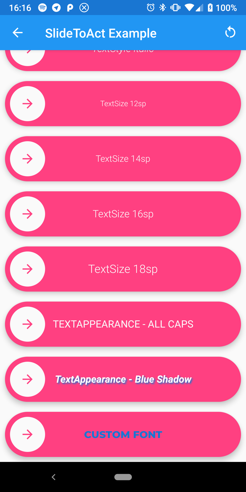</p>

#### ``slider_height``

Use the ``slider_height`` attribute to control the **desired height** of the widget. If not set, the widget will try to render with **72dp** of height.

<p align="center">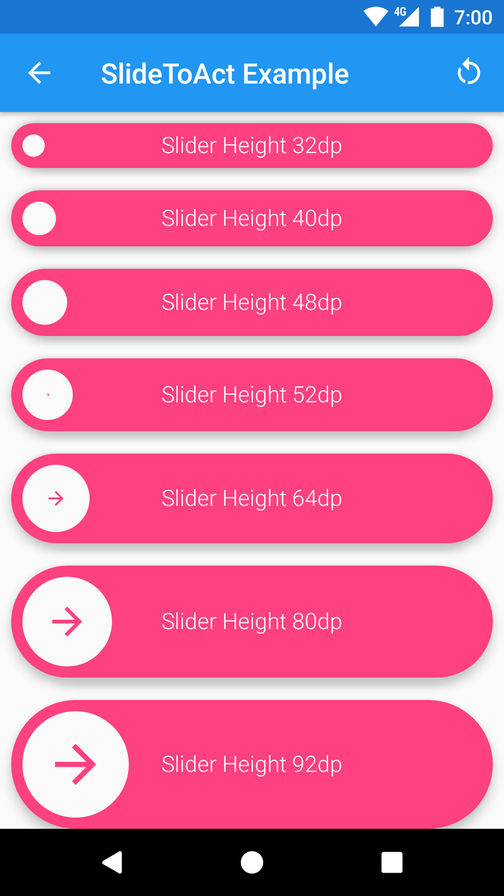 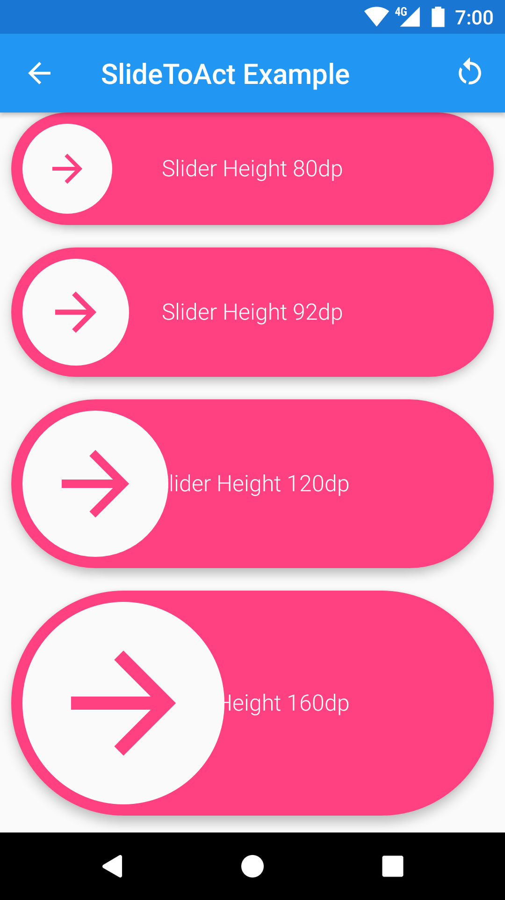</p>

#### ``slider_locked``

Use the ``slider_locked`` attribute to **lock the slider** (this is a boolean attribute). When a slider is locked, will always bump the button to the beginning (default is false).

<p align="center">
  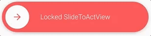
</p>

You can also toggle this attribute programmatically with the provided setter.

```java
SlideToActView sta = (SlideToActView) findViewById(R.id.slider);
sta.setLocked(true);
```

#### ``animation_duration``

Use the ``animation_duration`` attribute to **set the duration** of the complete and reset animation (in milliseconds).

You can also set animation duration programmatically with the provided setter.

```kotlin
val sta = (SlideToActView) findViewById(R.id.slider);
sta.animDuration = 600
```

#### ``slider_reversed``

Use the ``slider_reversed`` attribute to **reverse the slider** (this is a boolean attribute). When a slider is reversed, the cursor will appear on the right and will progress to the left. (default is false).

<p align="center">
  
</p>

You can also toggle this attribute programmatically with the provided setter.

```java
SlideToActView sta = (SlideToActView) findViewById(R.id.slider);
sta.setReversed(true);
```

#### ``slider_icon``

You can set a custom icon by setting the ``slider_icon``attribute to a drawable resource.

<p align="center">
  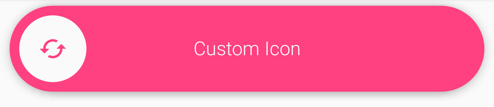
</p>

```xml
app:slider_icon="@drawable/custom_icon"
```

You can also set a custom icon programmatically with the provided setter.

```java
SlideToActView sta = findViewById(R.id.slider);
sta.setSliderIcon(R.drawable.custom_icon);
```

You can also disable the rotation by setting the ``rotate_icon`` attribute to false.

#### ``complete_icon``
You can set a custom complete icon by setting the ``complete_icon``attribute to a drawable resource.

<p align="center">
  
</p>

```xml
app:complete_icon="@drawable/slidetoact_ic_check"
```

You can also set a custom complete icon programmatically with the provided setter.

```java
SlideToActView sta = findViewById(R.id.slider);
sta.setCompleteIcon(R.drawable.custom_complete_animated);
```

#### ``slider_icon_color``

You can set a custom color for the icon by setting the ``slider_icon_color`` attribute.

<p align="center">
  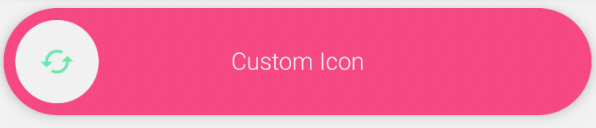
</p>

This attribute defaults to the ``outer_color`` if set. If ``outer_color`` is not set, this attribute defaults to **colorAccent** from your theme.

#### ``bump_vibration``

You can make the device vibrate when the cursor "bumps" to the end of the sliding path by setting the period of vibration through bump_vibration attribute in your layout XML (default is 0)

```xml
app:bump_vibration="50"
```

Note that the period of vibration is in milliseconds

You can achieve the same programmatically using the setter:

```java
SlideToActView sta = (SlideToActView) findViewById(R.id.slider);
sta.setBumpVibration(50);
```

In order for this feature to work, you need have the permission ```android.permission.VIBRATE``` in your AndroidManifest.xml

```xml
<uses-permission android:name="android.permission.VIBRATE"/>
```

#### ``android:elevation``

Use the ``android:elevation`` attribute to set the **elevation** of the widget. The widgets will take care of providing the proper ``ViewOutlineProvider`` during the whole animation (a.k.a. The shadow will be drawn properly).

<p align="center">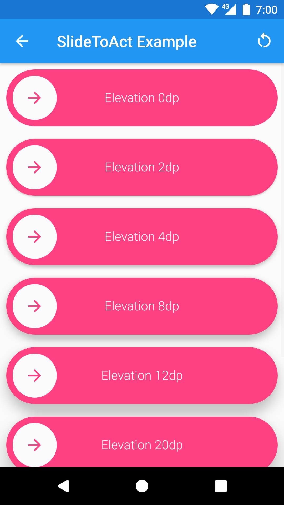 </p>

#### ``state_complete``

Use ``state_complete`` attribute to create ``SlideToActView`` in complete state.

```xml
app:state_complete="true"
```

Can be also set programmatically. 

With full slide animation:

```java
SlideToActView sta = (SlideToActView) findViewById(R.id.slider);
sta.setCompleted(completed: true, withAnimation: true);
```

Without slide animation:

```java
SlideToActView sta = (SlideToActView) findViewById(R.id.slider);
sta.setCompleted(completed: true, withAnimation: false);
```

<p align="center">
    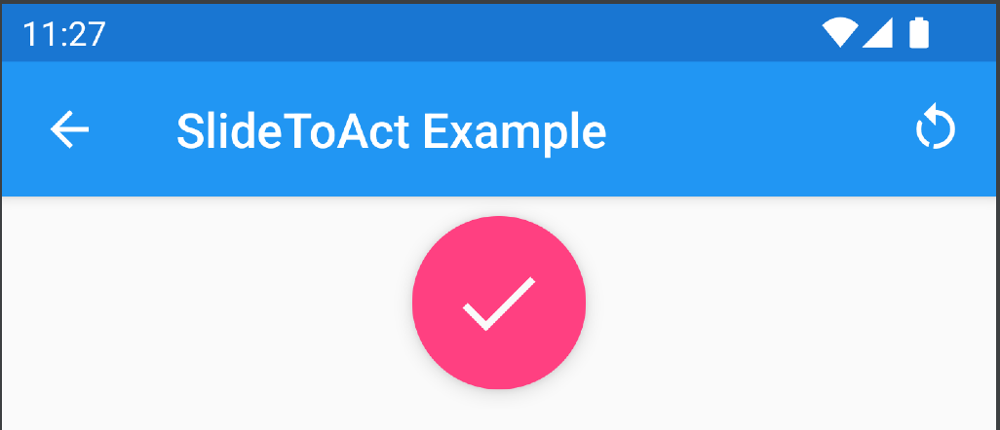
</p>


### Event callbacks

You can use the ``OnSlideCompleteListener`` and the ``OnSlideResetListener`` to simply interact with the widget. If you need to perform operations during animations, you can provide an ``OnSlideToActAnimationEventListener``. With the latter, you will be notified of every animation start/stop.

You can try the **Event Callbacks** in the [Demo app](#demo) to better understand where every callback is called.

<p align="center"></p>

## Demo 📲

Wonna see the widget in action? Just give a try to the **Example App**, it's inside the [**example**](example/) folder. 

Otherwise, you can just [download the **APK** from a CircleCI build](https://45-58338361-gh.circle-artifacts.com/0/tmp/circle-artifacts.uQdJ7rB/outputs/apk/example-debug.apk), and try it on a real device/emulator. 

<p align="center">
  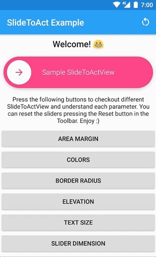
</p>

## Building/Testing ⚙️

### CircleCI [](https://circleci.com/gh/cortinico/slidetoact/tree/master)

This projects is built with [**Circle CI**](https://circleci.com/gh/cortinico/slidetoact/). The CI environment takes care of building the library .AAR, the example app and to run the **Espresso** tests. **Artifacts** are exposed at the end of every build (both the .AAR and the .APK of the example app).

### TravisCI [](https://travis-ci.org/cortinico/slidetoact)

[**TravisCI**](https://travis-ci.org/cortinico/slidetoact) builds are also running but they are considered **Legacy**. I'm probably going to dismiss it soon or later.

### Building locally

Before building, make sure you have the following **updated components** from the Android SDK:

* tools
* platform-tools
* build-tools-25.0.3
* android-25
* extra-android-support
* extra-android-m2repository
* extra-google-m2repository

Then just clone the repo locally and build the .AAR with the following command:

```bash
git clone git@github.com:cortinico/slidetoact.git
cd slidetoact/
./gradlew slidetoact:assemble
```

The assembled .AAR will be inside the **slidetoact/build/outputs/aar** folder.

### Testing

Once you're able to build successfully, you can run Espresso tests locally with the following command.

```bash
./gradlew clean build connectedCheck 
```

Make sure your tests are all green ✅ locally before submitting PRs.

## Contributing 🤝

**Looking for contributors! Don't be shy.** 😁 Feel free to open issues/pull requests to help me improve this project.

* When reporting a new Issue, make sure to attach **Screenshots**, **Videos** or **GIFs** of the problem you are reporting.
* When submitting a new PR, make sure tests are all green. Write new tests if necessary.

## Honorable mentions 🎖

* [flutter-slide-to-act](https://github.com/imtoori/flutter-slide-to-act) - A porting of this widget for Flutter

## License 📄

This project is licensed under the MIT License - see the [License](License) file for details
